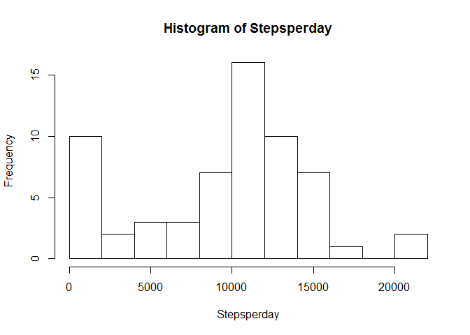
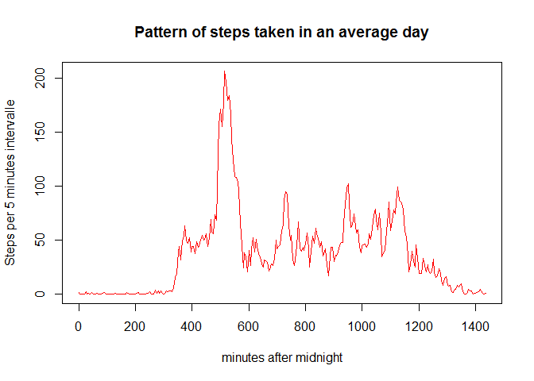
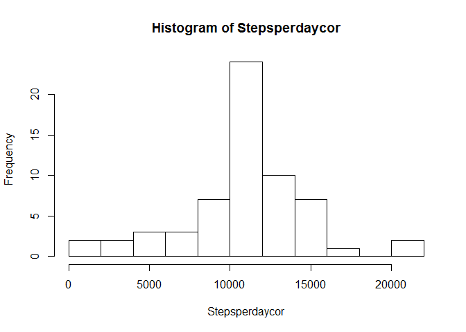
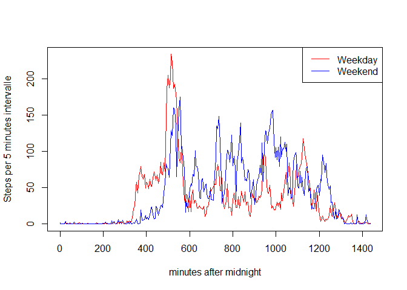

# Reproducible Research Assessment 1
JJ Brière  
Friday, June 12, 2015  
Note: this code works only with a French setup

### First we're going to download the data and get a quick overview
Note that the file will be downloaded in the working directory


```r
url <- "http://d396qusza40orc.cloudfront.net/repdata%2Fdata%2Factivity.zip"
download.file(url,destfile="data.zip")
data <- read.csv(unzip("data.zip"))
summary(data)
```

```
##      steps                date          interval     
##  Min.   :  0.00   2012-10-01:  288   Min.   :   0.0  
##  1st Qu.:  0.00   2012-10-02:  288   1st Qu.: 588.8  
##  Median :  0.00   2012-10-03:  288   Median :1177.5  
##  Mean   : 37.38   2012-10-04:  288   Mean   :1177.5  
##  3rd Qu.: 12.00   2012-10-05:  288   3rd Qu.:1766.2  
##  Max.   :806.00   2012-10-06:  288   Max.   :2355.0  
##  NA's   :2304     (Other)   :15840
```

##Notice here that the maximum 'interval' is 2355  
That shows that 'intervals' are named with a %H%m label (at 1:00 am the interval is named 100 and not 60). That way the data$interval doesn't constitute a continuous serie of data: it's 5,10,15,...,50,55,100,105  
So we are going to constuct a **continuous** series of intervals to add to our data:


```r
continterval <- as.integer(data$interval/100)*60+data$interval%%100
data <- data.frame(data,continterval)
head(data,3)
```

```
##   steps       date interval continterval
## 1    NA 2012-10-01        0            0
## 2    NA 2012-10-01        5            5
## 3    NA 2012-10-01       10           10
```

```r
tail(data,3)
```

```
##       steps       date interval continterval
## 17566    NA 2012-11-30     2345         1425
## 17567    NA 2012-11-30     2350         1430
## 17568    NA 2012-11-30     2355         1435
```

# Average of steps taken per day

### Calculation of the number of steps taken per day


```r
Stepsperday <- sapply(split(data$steps,data$date),sum,na.rm=TRUE)
Stepsperday
```

```
## 2012-10-01 2012-10-02 2012-10-03 2012-10-04 2012-10-05 2012-10-06 
##          0        126      11352      12116      13294      15420 
## 2012-10-07 2012-10-08 2012-10-09 2012-10-10 2012-10-11 2012-10-12 
##      11015          0      12811       9900      10304      17382 
## 2012-10-13 2012-10-14 2012-10-15 2012-10-16 2012-10-17 2012-10-18 
##      12426      15098      10139      15084      13452      10056 
## 2012-10-19 2012-10-20 2012-10-21 2012-10-22 2012-10-23 2012-10-24 
##      11829      10395       8821      13460       8918       8355 
## 2012-10-25 2012-10-26 2012-10-27 2012-10-28 2012-10-29 2012-10-30 
##       2492       6778      10119      11458       5018       9819 
## 2012-10-31 2012-11-01 2012-11-02 2012-11-03 2012-11-04 2012-11-05 
##      15414          0      10600      10571          0      10439 
## 2012-11-06 2012-11-07 2012-11-08 2012-11-09 2012-11-10 2012-11-11 
##       8334      12883       3219          0          0      12608 
## 2012-11-12 2012-11-13 2012-11-14 2012-11-15 2012-11-16 2012-11-17 
##      10765       7336          0         41       5441      14339 
## 2012-11-18 2012-11-19 2012-11-20 2012-11-21 2012-11-22 2012-11-23 
##      15110       8841       4472      12787      20427      21194 
## 2012-11-24 2012-11-25 2012-11-26 2012-11-27 2012-11-28 2012-11-29 
##      14478      11834      11162      13646      10183       7047 
## 2012-11-30 
##          0
```

### Now we make a histogram of the total number of steps taken each day


```r
hist(Stepsperday,breaks=10)
```

 

### Calculation of mean and median of the total number of steps taken per day


```r
meanSteps <- mean(Stepsperday)
medianSteps <- median(Stepsperday)
print(paste("The average number of steps taken per day is ", meanSteps))
```

```
## [1] "The average number of steps taken per day is  9354.22950819672"
```

```r
print(paste("The median number of steps taken per day is ", medianSteps))
```

```
## [1] "The median number of steps taken per day is  10395"
```

# Daily activity pattern
### Now let's have a look at the average number of steps taken accross all days
here we'd rather not use the discontinuous data[interval] to plot the x axis:  
we are going to use the data[continterval] we've created before


```r
timeserie <- sapply(split(data$steps,data$continterval),mean,na.rm=TRUE)
plot(x=names(timeserie),timeserie,type="l",ylab="Steps per 5 minutes intervalle",xlab="minutes after midnight",col="red",main="Pattern of steps taken in an average day")
```

 

### Calculation of the maximum number of steps, on average accross all the days

```r
maxSteps <- timeserie[timeserie==max(timeserie)]
minutes=as.integer(names(maxSteps))
print(paste("the maximum number of steps per day is taken at the ",
      minutes, "minutes after midnight"))
```

```
## [1] "the maximum number of steps per day is taken at the  515 minutes after midnight"
```

```r
heure <- as.integer(minutes/60)
min <- minutes - 60 * heure
timemax <- paste(heure,":",min,sep="")
print(paste("this is around",timemax, "h"))
```

```
## [1] "this is around 8:35 h"
```

# Cleaning of the data
### Looking for NA values


```r
for (i in names(data)) {
        s <- sum(is.na(data[,i]))
        print(paste("there are",s,"NA in the values of ",i))
}
```

```
## [1] "there are 2304 NA in the values of  steps"
## [1] "there are 0 NA in the values of  date"
## [1] "there are 0 NA in the values of  interval"
## [1] "there are 0 NA in the values of  continterval"
```

### In order to avoid bias due to missing value
we are going to fill NA with the average number of steps takin in the 5-minutes interval


```r
#CorrectNA take a data set for one day and return a dataset with replacement of NA values in "steps" by the values of ref_vect
CorrectNA <- function(datasplit,ref_vect) {
        tempdata <- datasplit
        temp <- tempdata$steps
        temp[is.na(temp)] <- ref_vect[is.na(temp)]
        tempdata$steps <- temp
        tempdata
}
# remember that timeserie is the average steps by interval, it's our ref_vect

CorrectData <- split(data,data$date)
for (i in names(CorrectData)) {
        CorrectData[[i]] <- CorrectNA(CorrectData[[i]],timeserie)
        } # I was unable to use a lapply function to avoid that for loop...
CorrectData <- unsplit(CorrectData,data$date)
summary(CorrectData)
```

```
##      steps                date          interval       continterval   
##  Min.   :  0.00   2012-10-01:  288   Min.   :   0.0   Min.   :   0.0  
##  1st Qu.:  0.00   2012-10-02:  288   1st Qu.: 588.8   1st Qu.: 358.8  
##  Median :  0.00   2012-10-03:  288   Median :1177.5   Median : 717.5  
##  Mean   : 37.38   2012-10-04:  288   Mean   :1177.5   Mean   : 717.5  
##  3rd Qu.: 27.00   2012-10-05:  288   3rd Qu.:1766.2   3rd Qu.:1076.2  
##  Max.   :806.00   2012-10-06:  288   Max.   :2355.0   Max.   :1435.0  
##                   (Other)   :15840
```

### With the "Corrected Data" we trace an histogram of the total number of steps taken each day 


```r
Stepsperdaycor <- sapply(split(CorrectData$steps,CorrectData$date),sum,na.rm=TRUE)
hist(Stepsperdaycor,breaks=10)
```

 

```r
meanStepscor <- mean(Stepsperdaycor)
medianStepscor <- median(Stepsperdaycor)
print(paste("The average number of steps taken per day is ", as.integer(meanStepscor)))
```

```
## [1] "The average number of steps taken per day is  10766"
```

```r
print(paste("The median number of steps taken per day is ", as.integer(medianStepscor)))
```

```
## [1] "The median number of steps taken per day is  10766"
```
Here we can see that the 'correction' of NA value by the  numbers of steps taken in average day at the same intervall, lead to numerous entire days corrected. This can be suspected with the first histogram (before correction). There was 10 days where no steps were recorded. Probably these days only recoded NA. By replacing the NA with the average daily pattern, we've artificially "enriched" our dataset with some "average day". That's why median and mean numbers of steps taken per day are equal. The fact that the mean has increased is due to the replacement of these NA days (which average steps per day were estimated at 0) by average days (with non null average steps per day)


# differences in activity patterns between weekdays and weekends

## First we'll add the information of the weekday to the data


```r
Days <- weekdays(as.POSIXct(data$date,format="%Y-%m-%d"))
WeekDays <- Days
# Note that my computer is set up in French
WeekDays[Days=="lundi"] <- "Weekday"
WeekDays[Days=="mardi"] <- "Weekday"
WeekDays[Days=="mercredi"] <- "Weekday"
WeekDays[Days=="jeudi"] <- "Weekday"
WeekDays[Days=="vendredi"] <- "Weekday"
WeekDays[Days=="samedi"] <- "Weekend"
WeekDays[Days=="dimanche"] <- "Weekend"
data2 <- data.frame(data,Days=Days,Weekdays=WeekDays)
summary(data2)
```

```
##      steps                date          interval       continterval   
##  Min.   :  0.00   2012-10-01:  288   Min.   :   0.0   Min.   :   0.0  
##  1st Qu.:  0.00   2012-10-02:  288   1st Qu.: 588.8   1st Qu.: 358.8  
##  Median :  0.00   2012-10-03:  288   Median :1177.5   Median : 717.5  
##  Mean   : 37.38   2012-10-04:  288   Mean   :1177.5   Mean   : 717.5  
##  3rd Qu.: 12.00   2012-10-05:  288   3rd Qu.:1766.2   3rd Qu.:1076.2  
##  Max.   :806.00   2012-10-06:  288   Max.   :2355.0   Max.   :1435.0  
##  NA's   :2304     (Other)   :15840                                    
##        Days         Weekdays    
##  dimanche:2304   Weekday:12960  
##  jeudi   :2592   Weekend: 4608  
##  lundi   :2592                  
##  mardi   :2592                  
##  mercredi:2592                  
##  samedi  :2304                  
##  vendredi:2592
```

# Now let see the difference of pattern between week days and week ends


```r
splitdata <- split(data2,data2$Weekdays)
timeserieWeekday <- sapply(split(splitdata[["Weekday"]]$steps,splitdata[["Weekday"]]$continterval),mean,na.rm=TRUE)
timeserieWeekend <- sapply(split(splitdata[["Weekend"]]$steps,splitdata[["Weekend"]]$continterval),mean,na.rm=TRUE)

plot(x=names(timeserieWeekday),y=timeserieWeekday,type="l",ylab="Steps per 5 minutes intervalle",xlab="minutes after midnight",col="red")
points(x=names(timeserieWeekend),y=timeserieWeekend,type="l",ylab="Steps per 5 minutes intervalle",xlab="minutes after midnight",col="blue")
legend("topright",lty=1,col=c("red","blue"),legend=c("Weekday","Weekend"))
```

 

We can see a shift in the activity. There are less steps taken in the morning ans more in the evening... I guess we shouldn't be surprised of that result!  
  
Thanks for reading.
